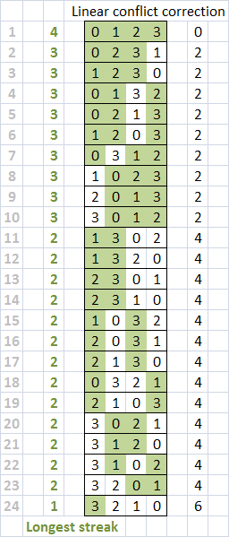

# N-PUZZLE, Nov 2015
>>>>> #####A* pathfinder. (group project)

#####Grade ``(tbd/100)`` ``(tbd/125)*``
--------  -----------------------

Team: [jaguillo](https://github.com/Julow) / [ngoguey](https://github.com/Ngoguey42).
<BR>

#####Goals:
- [X] Implement an A* algorithm.
- [X] Implement 3 admissibles heuristics.
- [X] Reach the 'snail solution' as 'goal solution' (see below)
- [ ] Handle any puzzle size without crashing.
- [ ] Grid loader (from file) and generator.
- [ ] Ouput some data from the solving phase.
- [X] Solve an **8-puzzle** in **less than 5 seconds**.

#####Recommended bonuses:
- [X] Use approriate containers for A*.
- [ ] Provide an uniform-cost search.
- [ ] Provide a greedy search.

#####Our work:
- [X] Opportunity to write our libftui(TODO: LINK!) (75% of our project), providing an high-level UI for this project and the next ones.
- [X] Opportunity to use OCaml in a real project, for the *first time*.
- [X] Disjoint Pattern Databases Heuristic(see below), allowing us to solve any **15-puzzles** in **less than 5 seconds**.
- [X] Careful study of graph traversal algorithms.
- [X] IDA* implementation. (as extra)


```shell
curl -O http://www.lua.org/ftp/lua-5.3.1.tar.gz &&
tar -zxf lua-5.3.1.tar.gz &&
cd lua-5.3.1 &&
make linux &&
make test &&
sudo make install &&
cd .. &&
rm -rf lua-5.3.1.tar.gz lua-5.3.1
```

<BR>
Snail solutions:<BR>
<BR>
Disjoint Pattern Databases:<BR>
<BR>
<BR>
<BR>
<BR>

<BR>Useful links:<BR>
https://www.jair.org/media/1480/live-1480-2332-jair.pdf

```
*
- A grade of 85 was required to validate the project.
- A maximum grade of 125 was reachable.
- Second sessions are organised for failed projects.
```
